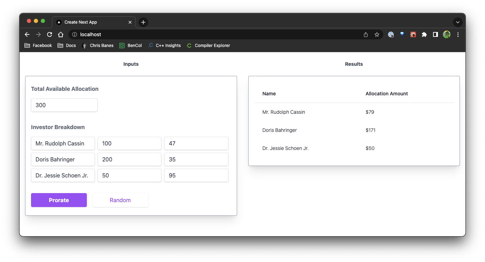

# Architecture Overview


---

## Try Out Locally

1. If you have [Docker](https://www.docker.com/) installed, you could follow [Use Docker Compose](#use-docker-compose) instruction.
2. If you have [Minikuber](https://minikube.sigs.k8s.io/docs/start/) installed, you could follow [Use Minikube](#use-minikube) instruction.

Here is the preview:



### Use Docker Compose

1. Use Docker-Compose to deploy web, api-server, and db Docker containers locally on your machine.
```
$ docker-compose -f deploy-compose/DockerCompose.yml up -d
```

2. Open [website](http://localhost) in your browser.

3. Use Docker-Compose to take down the containers if you're done with testing.

```
$ docker-compose -f deploy-compose/DockerCompose.yml down
```

### Use Minikube

Sorry, it's still WIP.

---

## Directory Overview
```
.
├── backend
├── deploy-compose
└── frontend
```

* `backend/` is the Rails API server.
* `frontend/` is the NextJS web server.
* `deploy-compose/` contains the Docker-compose file for local deployment (for test or debug)

